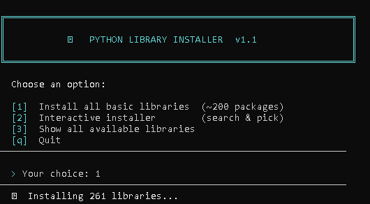

# 🐍 Python Library Installer

<div align="center">


A hardcore terminal-based Python library installer with fuzzy search, smart suggestions, and zero mercy

[Features](#-features) • [Installation](#-installation) • [Usage](#-usage) • [Library List](#-library-categories) • [Contributing](#-contributing)

</div>

---

## 📖 About

No GUI. No bloat. Just a raw terminal tool that installs Python libraries fast.  
Pick from **~200 pre-listed packages** or type any name — the tool fuzzy-matches it, suggests corrections, and lets you decide. Everything is in English. Everything is brutal.

## ✨ Features

- 📦 **~200 Pre-listed Libraries** — Covers data science, web, bots, ML, DevOps, and more
- 🔍 **Fuzzy Matching** — Typo? It finds what you meant and asks before installing
- ⚡ **Progress Bar** — Visual install progress with percentage tracking
- 🎯 **Interactive Mode** — Search and install libraries one by one
- 📋 **Full Library Browser** — `list` command shows all 200+ known packages
- 🖥️ **Terminal Colors** — Clear visual feedback: green = good, red = dead
- 🔄 **Batch + Single** — Install everything at once OR pick what you need

## 📸 Screenshots



## 📋 Supported Library Categories

| Category | Examples |
|----------|---------|
| 🌐 Web & HTTP | requests, httpx, aiohttp, fastapi, flask, django |
| 🤖 ML & AI | torch, tensorflow, scikit-learn, transformers, keras |
| 📊 Data Science | numpy, pandas, matplotlib, seaborn, plotly, scipy |
| 🗄️ Databases | sqlalchemy, pymongo, redis, psycopg2, elasticsearch |
| 🤖 Bots | aiogram, python-telegram-bot, discord.py, slack-sdk |
| 🔐 Security | cryptography, bcrypt, pyjwt, passlib, authlib |
| 🧪 Testing | pytest, hypothesis, faker, coverage, mock |
| 🖥️ CLI | click, typer, rich, colorama, tqdm, prompt-toolkit |
| ☁️ Cloud | boto3, google-cloud-storage, azure-storage-blob, docker |
| 🎵 Audio/Video | librosa, opencv-python, pydub, ffmpeg-python |
| + many more | geo, graph, NLP, scraping, scheduling, logging... |

## 🚀 Installation

### Prerequisites

- Python 3.8 or higher
- pip (comes with Python)
- A terminal

### Quick Start

```bash
# 1. Download the script
git clone https://github.com/yourusername/py-lib-installer.git
cd py-lib-installer

# 2. Run it — that's it. No dependencies needed.
python installer.py
```

> ⚡ The installer uses only Python standard library (`subprocess`, `difflib`, `sys`, `os`) — **zero setup required**.

## 💻 Usage

### Main Menu

```
╔══════════════════════════════════════════════════════════════╗
║           🐍  PYTHON LIBRARY INSTALLER  v1.0                 ║
║           No mercy. No fluff. Just installs.                 ║
╚══════════════════════════════════════════════════════════════╝

  Choose an option:

  [1]  Install all basic libraries  (~200 packages)
  [2]  Interactive installer        (search & pick)
  [3]  Show all available libraries
  [q]  Quit
```

---

### Option 1 — Install All Basic Libraries

Installs all ~200 pre-listed packages in one go with a real-time progress bar:

```
  [████████████░░░░░░░░] 60%   Installing  numpy ... ✔ OK
  [█████████████░░░░░░░] 65%   Installing  pandas ... ✔ OK
  [██████████████░░░░░░] 70%   Installing  matplotlib ... ✘ FAILED
```

At the end you get a full summary:
```
  ✔ Installed: 195/200
  ✘ Failed (5): tensorflow, torch, ...
```

---

### Option 2 — Interactive Mode

Search and install libraries by name:

```
  > Enter library name: nummpy
```

If the name is slightly wrong, the tool catches it:

```
  ⚠  'nummpy' not in known list. Did you mean:
       [1] numpy
       [2] sympy
       [3] numba
       [n] No — install 'nummpy' as-is anyway
       [s] Skip
  > Your choice: 1
  Installing numpy...  ✔ OK
```

If the name is completely unknown:

```
  > Enter library name: xXfakeLibXx

  Unknown library 'xXfakeLibXx'. Install it anyway? [y/n]: n
  Skipped.
```

**Interactive mode commands:**

| Command | Action |
|---------|--------|
| `list` | Show all ~200 known libraries |
| `done` | Finish the session |
| `quit` / `q` | Exit the program |

---

## 🔧 How Fuzzy Matching Works

Uses Python's built-in `difflib.get_close_matches()` with a cutoff of `0.4`.

| You type | It suggests |
|----------|-------------|
| `reqests` | `requests` |
| `flusk` | `flask` |
| `nummpy` | `numpy` |
| `pilo` | `pillow` |
| `skleran` | `scikit-learn` |

You always get the final say: pick a suggestion, install as-is, or skip.

---

## 📁 Project Structure

```
py-lib-installer/
│
├── installer.py          # The entire tool — single file, no dependencies
├── README.md             # This file
└── LICENSE               # MIT License
```

## 🔒 Notes

- Installation runs `pip install <package> --quiet` under the hood
- Failed installs don't crash the session — they're logged and skipped
- Works on Windows, Linux, macOS
- On Windows, ANSI colors are auto-enabled via `os.system("color")`

## 🐛 Troubleshooting

**Colors not showing on Windows:**
- Run in Windows Terminal or PowerShell (not old CMD)
- Or install `colorama` first: `pip install colorama`

**Package fails to install:**
- Some packages (like `torch`) need special install commands or CUDA versions
- Run manually: `pip install torch --index-url https://download.pytorch.org/whl/cpu`

**Permission errors:**
- Use `pip install --user <package>` or run with admin/sudo

## 📊 Performance

- **Startup time:** instant (no imports to load)
- **Per-package install:** depends on PyPI + your connection
- **Memory:** ~10–20 MB while running

## 🤝 Contributing

Pull requests are welcome.

1. Fork the repository
2. Create your branch (`git checkout -b feature/CoolFeature`)
3. Commit your changes (`git commit -m 'Add CoolFeature'`)
4. Push (`git push origin feature/CoolFeature`)
5. Open a Pull Request

Ideas for contributions:
- Add more libraries to the list
- Add `requirements.txt` export
- Add virtual environment creation
- Add version pinning support

## 📝 License

MIT License — do whatever you want with it.

## 👨‍💻 Author

**Your Name Here**

- GitHub: [@yourusername](https://github.com/yourusername)

---

<div align="center">

**If this saved you time, give it a ⭐️**

Made with 💀 and caffeine

</div>
